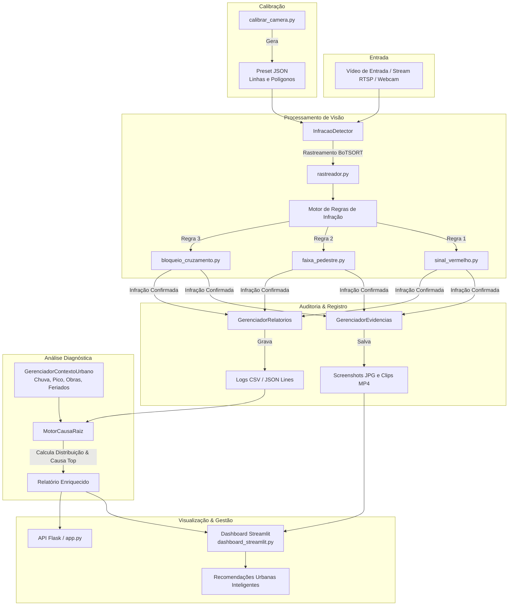

# 🏛️ Arquitetura do Sistema CogniMove

O **CogniMove** é uma plataforma integrada de inteligência artificial e visão computacional voltada para monitoramento viário, detecção automática de infrações e diagnóstico de causa-raiz no trânsito urbano.

---

## 🧩 Visão Geral dos Módulos

O projeto é estruturado em cinco módulos principais, garantindo desacoplamento e clareza de responsabilidades:

1. **`backend/calibration/` (Módulo de Calibração Viária)**
   - **Papel:** Ferramenta gráfica interativa baseada em OpenCV ([`calibrar_camera.py`](backend/calibration/calibrar_camera.py)) para mapear a geometria do cruzamento.
   - **Entradas/Saídas:** Desenho interativo do usuário via mouse/teclado gerando arquivos JSON armazenados em `backend/calibration/presets/` contendo coordenadas de linhas de retenção, polígonos de faixa de pedestres/bike box e zonas de interseção.

2. **`backend/detection/` (Motor de Visão Computacional e Regras)**
   - **Papel:** Core de detecção em tempo real e orquestração do pipeline visual.
   - **Componentes:**
     - `InfracaoDetector`: Orquestrador principal da análise de frames (em [`detector.py`](backend/detection/infracoes/detector.py)), responsável pela execução dos modelos YOLO, aplicação de regras, montagem dos overlays visuais (bounding boxes, zonas e alertas no frame) e emissão de eventos.
     - `rastreador.py`: Rastreamento multi-objeto usando BoTSORT com IDs persistentes.
     - `regras/`: Motor de regras de trânsito ([`sinal_vermelho.py`](backend/detection/infracoes/regras/sinal_vermelho.py), [`faixa_pedestre.py`](backend/detection/infracoes/regras/faixa_pedestre.py), [`bloqueio_cruzamento.py`](backend/detection/infracoes/regras/bloqueio_cruzamento.py)).
     - `evidencias.py`: Gerenciamento de buffers de vídeo para salvar screenshots `.jpg` e clips `.mp4`.
     - `relatorio.py`: Gravação concorrente de logs de auditoria em formatos `.csv` e `.jsonl`.
     - `utils_video.py`: Resolução centralizada de fontes de vídeo (webcam, RTSP, arquivos).

3. **`backend/analytics/` (Motor Probabilístico de Causa-Raiz)**
   - **Papel:** Enriquecimento diagnóstico dos eventos infracionais com base no contexto urbano.
   - **Componentes:**
     - `contexto_urbano.py`: Gerenciador thread-safe de fatores externos (chuva forte, horário de pico, jogos, feriados, obras).
     - `causa_raiz.py`: Motor de inferência probabilística que combina o tipo de infração com modificadores contextuais para determinar a causa-raiz predominante e sua confiança.

4. **`backend/training/` (Engenharia de Dados e Treinamento)**
   - **Papel:** Pipeline ETL e treinamento de modelos de deep learning (YOLOv8).
   - **Componentes:**
     - `merge_datasets.py`: Fusão limpa e sanitização de datasets locais e Roboflow.
     - `yolo_train.py`: Treinamento do modelo com criação automática de backups com timestamp em `backend/models/`.
     - `dataset_limite.py`: Geração e augmentação de dados com validação de resolução de vídeo.

5. **`frontend/` (Estação Interativa e Interfaces)**
   - **Papel:** Visualização, controle e apoio à gestão urbana.
   - **Componentes:**
     - `dashboard_streamlit.py`: Estação interativa de mobilidade (Área 1: Simulador de Câmera; Área 2: Simulador de Fatores Externos; Área 3: Centro de Diagnóstico Inteligente).
     - `recomendacoes.py`: Mapeamento de recomendações públicas para órgãos de trânsito.
     - `utils_dashboard.py`: Utilitários de dados com proteção contra exceções em séries nulas.
     - `app.py`: Servidor API Flask para streaming MJPEG e endpoints de relatórios.

---

## 🔄 Fluxo de Dados do Sistema



---

## 📊 Modelo de Dados e Regras de Infração

O sistema cataloga três tipos principais de infrações de trânsito:

| Tipo de Infração | Regra Correspondente | Condições para Disparo |
| :--- | :--- | :--- |
| **`AVANCO_SINAL_VERMELHO`** | [`sinal_vermelho.py`](backend/detection/infracoes/regras/sinal_vermelho.py) | O semáforo associado à via está no estado `RED` e o ponto inferior do veículo cruza a linha de retenção calibrada. |
| **`INVASAO_FAIXA`** | [`faixa_pedestre.py`](backend/detection/infracoes/regras/faixa_pedestre.py) | O semáforo está `RED` (ou área exclusiva) e o veículo adentra o polígono demarcado da faixa de pedestres / bike box. |
| **`BLOQUEIO_CRUZAMENTO`** | [`bloqueio_cruzamento.py`](backend/detection/infracoes/regras/bloqueio_cruzamento.py) | O veículo permanece retido dentro do polígono de interseção ("amarelo") por tempo superior ao limiar de cooldown (ex.: 5 segundos). |

---

## 🧪 Como Rodar os Testes

A suíte de testes unitários é mantida sob a pasta `backend/tests/`. Ela inclui mocks automáticos de dependências pesadas (como PyTorch/Ultralytics) para garantir execução ultra-rápida.

Para executar todos os testes:
```bash
pytest backend/tests/ -v
```

> 💡 **Boa Prática:** Sempre execute a suíte de testes antes de realizar novos commits ou abrir Pull Requests para assegurar que nenhuma regra de negócio ou regressão de código foi introduzida.
